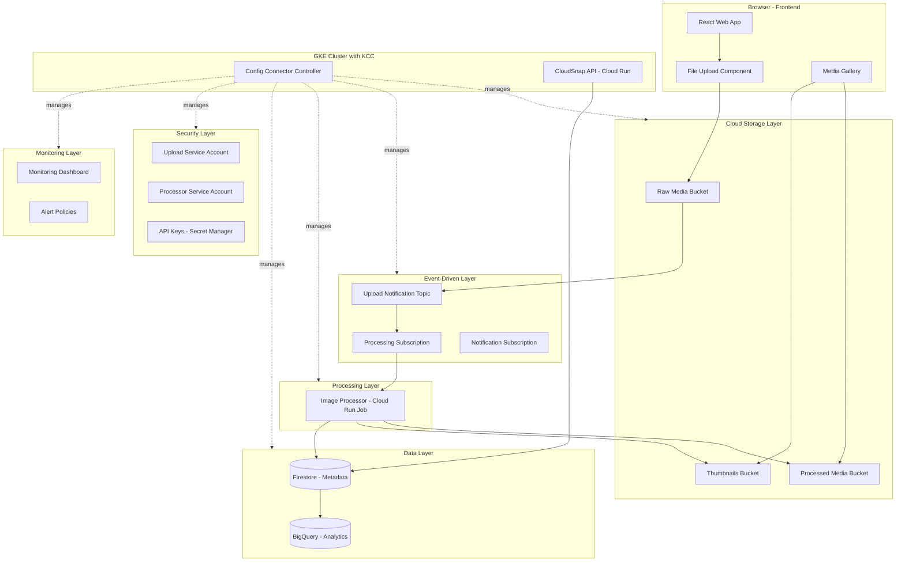
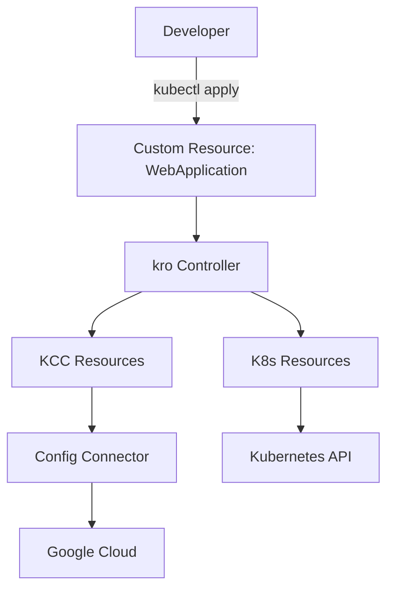
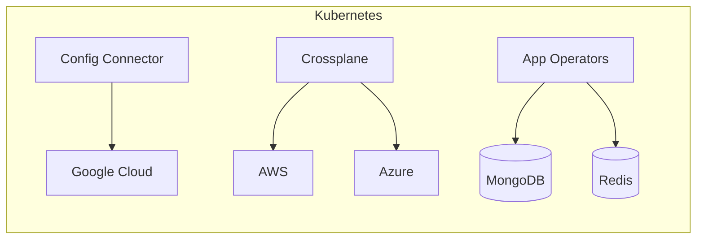
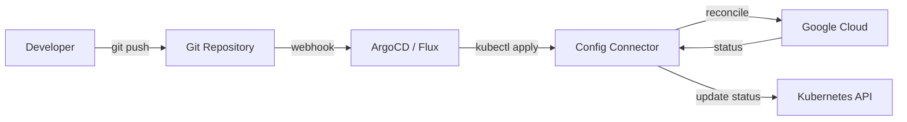

# KCC Demo: CloudSnap - Media Processing Platform

## Overview

This demo showcases **Google Kubernetes Engine Config Connector (KCC)** by building a real-world media processing platform called **CloudSnap**. The platform demonstrates how to manage Google Cloud resources declaratively using Kubernetes-native YAML manifests.

### What is Config Connector (KCC)?

Config Connector is a Kubernetes add-on that allows you to manage Google Cloud resources through Kubernetes Resource Model (KRM). Instead of using `gcloud` commands, Terraform, or the Console, you define GCP resources as Kubernetes Custom Resources (CRs) and apply them with `kubectl`.

**Key Benefits:**
- GitOps-friendly infrastructure management
- Kubernetes-native resource lifecycle management
- RBAC for access control
- Eventual consistency with automatic reconciliation
- Single source of truth in your Git repository

> **GKE Autopilot Support:** Config Connector is fully supported on GKE Autopilot clusters as a managed add-on. Autopilot has Workload Identity enabled by default, which is the recommended authentication method for KCC. No node pool configuration is required—KCC runs as a system workload managed by Google.

---

## Demo Architecture: CloudSnap Media Platform



---

## Real-World Use Cases Demonstrated

### 1. **E-Commerce Product Image Processing**
When merchants upload product photos, the system automatically:
- Generates multiple thumbnail sizes
- Optimizes images for web delivery
- Extracts metadata for search indexing
- Archives originals in cold storage

### 2. **Social Media Content Moderation**
User-uploaded content flows through:
- Content safety analysis
- Automatic tagging and categorization
- Storage tiering based on engagement
- Analytics pipeline for trending content

### 3. **Healthcare Document Digitization**
Medical facilities processing scanned documents:
- OCR extraction to searchable text
- PHI detection and redaction
- Secure storage with audit logging
- Compliance-ready access controls

---

## GCP Resources Managed by KCC

| Category | Resource | KCC Kind | Purpose |
|----------|----------|----------|---------|
| **Storage** | Raw uploads bucket | `StorageBucket` | Store original uploaded files |
| **Storage** | Processed bucket | `StorageBucket` | Store processed media |
| **Storage** | Thumbnails bucket | `StorageBucket` | Store generated thumbnails |
| **Messaging** | Upload notifications | `PubSubTopic` | Notify on new uploads |
| **Messaging** | Processing subscription | `PubSubSubscription` | Queue for processor |
| **Compute** | API Service | `RunService` | REST API for frontend |
| **Compute** | Processor Job | `RunJob` | Media processing worker |
| **Database** | Metadata store | `FirestoreDatabase` | Store file metadata |
| **Analytics** | Analytics dataset | `BigQueryDataset` | Analytics data warehouse |
| **Analytics** | Events table | `BigQueryTable` | Processing events log |
| **Security** | Upload SA | `IAMServiceAccount` | Identity for upload operations |
| **Security** | Processor SA | `IAMServiceAccount` | Identity for processing jobs |
| **Security** | API Keys | `SecretManagerSecret` | Secure credential storage |
| **IAM** | Bucket policies | `IAMPolicyMember` | Access control bindings |
| **Monitoring** | Processing dashboard | `MonitoringDashboard` | Operational visibility |
| **Monitoring** | Error alerts | `MonitoringAlertPolicy` | Alerting on failures |

---

## All Supported GCP Services

Config Connector supports **350+ resource types** across the following GCP services.

📚 **Official Documentation:**
- [KCC Resource Reference](https://cloud.google.com/config-connector/docs/reference/overview) - Complete list of all supported resources
- [KCC Release Notes](https://cloud.google.com/config-connector/docs/release-notes) - New resources added in each release
- [KCC GitHub Repository](https://github.com/GoogleCloudPlatform/k8s-config-connector) - Source code and issues

| Category | Services |
|----------|----------|
| **Compute** | [Compute Engine](https://cloud.google.com/compute), [GKE](https://cloud.google.com/kubernetes-engine), [Cloud Run](https://cloud.google.com/run), [Cloud Functions](https://cloud.google.com/functions), [App Engine](https://cloud.google.com/appengine) |
| **Storage** | [Cloud Storage](https://cloud.google.com/storage), [Filestore](https://cloud.google.com/filestore), [Persistent Disk](https://cloud.google.com/persistent-disk) |
| **Databases** | [Cloud SQL](https://cloud.google.com/sql), [Cloud Spanner](https://cloud.google.com/spanner), [Firestore](https://cloud.google.com/firestore), [Bigtable](https://cloud.google.com/bigtable), [Memorystore](https://cloud.google.com/memorystore), [AlloyDB](https://cloud.google.com/alloydb) |
| **Data & Analytics** | [BigQuery](https://cloud.google.com/bigquery), [Dataflow](https://cloud.google.com/dataflow), [Dataproc](https://cloud.google.com/dataproc), [Pub/Sub](https://cloud.google.com/pubsub), [Data Catalog](https://cloud.google.com/data-catalog), [Dataplex](https://cloud.google.com/dataplex) |
| **AI & ML** | [Vertex AI](https://cloud.google.com/vertex-ai), [AI Platform](https://cloud.google.com/ai-platform), [AutoML](https://cloud.google.com/automl), [Document AI](https://cloud.google.com/document-ai) |
| **Networking** | [VPC](https://cloud.google.com/vpc), [Cloud DNS](https://cloud.google.com/dns), [Cloud NAT](https://cloud.google.com/nat), [Cloud Armor](https://cloud.google.com/armor), [Cloud CDN](https://cloud.google.com/cdn), [Load Balancing](https://cloud.google.com/load-balancing), [Service Networking](https://cloud.google.com/service-infrastructure/docs/service-networking/getting-started) |
| **Security** | [IAM](https://cloud.google.com/iam), [Secret Manager](https://cloud.google.com/secret-manager), [Certificate Manager](https://cloud.google.com/certificate-manager), [Binary Authorization](https://cloud.google.com/binary-authorization), [Security Command Center](https://cloud.google.com/security-command-center) |
| **Identity** | [Identity Platform](https://cloud.google.com/identity-platform), [Managed Service for Microsoft AD](https://cloud.google.com/managed-microsoft-ad) |
| **Management** | [Cloud Logging](https://cloud.google.com/logging), [Cloud Monitoring](https://cloud.google.com/monitoring), [Cloud Asset Inventory](https://cloud.google.com/asset-inventory), [Resource Manager](https://cloud.google.com/resource-manager) |
| **Developer Tools** | [Artifact Registry](https://cloud.google.com/artifact-registry), [Container Registry](https://cloud.google.com/container-registry), [Cloud Build](https://cloud.google.com/build), [Source Repositories](https://cloud.google.com/source-repositories) |
| **Serverless** | [Cloud Run](https://cloud.google.com/run), [Cloud Functions](https://cloud.google.com/functions), [Cloud Scheduler](https://cloud.google.com/scheduler), [Cloud Tasks](https://cloud.google.com/tasks), [Eventarc](https://cloud.google.com/eventarc), [Workflows](https://cloud.google.com/workflows) |
| **API Management** | [API Gateway](https://cloud.google.com/api-gateway), [Apigee](https://cloud.google.com/apigee), [Service Management](https://cloud.google.com/service-infrastructure), [Endpoints](https://cloud.google.com/endpoints) |
| **Migration** | [Database Migration Service](https://cloud.google.com/database-migration), [Transfer Appliance](https://cloud.google.com/transfer-appliance) |
| **Operations** | [Cloud Deploy](https://cloud.google.com/deploy), [Cloud Composer](https://cloud.google.com/composer), [Config Controller](https://cloud.google.com/anthos-config-management/docs/concepts/config-controller-overview) |
| **Hybrid & Multi-cloud** | [Anthos](https://cloud.google.com/anthos), [GKE Enterprise](https://cloud.google.com/kubernetes-engine/enterprise/docs), [Connect Gateway](https://cloud.google.com/anthos/multicluster-management/gateway) |

### Complete KCC Resource Types by Service

<details>
<summary><strong>Access Context Manager</strong></summary>

- `AccessContextManagerAccessLevel`
- `AccessContextManagerAccessPolicy`
- `AccessContextManagerServicePerimeter`
- `AccessContextManagerServicePerimeterResource`

</details>

<details>
<summary><strong>AlloyDB</strong></summary>

- `AlloyDBBackup`
- `AlloyDBCluster`
- `AlloyDBInstance`
- `AlloyDBUser`

</details>

<details>
<summary><strong>API Gateway</strong></summary>

- `APIGatewayAPI`
- `APIGatewayAPIConfig`
- `APIGatewayGateway`

</details>

<details>
<summary><strong>Apigee</strong></summary>

- `ApigeeEnvironment`
- `ApigeeInstance`
- `ApigeeInstanceAttachment`
- `ApigeeNATAddress`
- `ApigeeOrganization`

</details>

<details>
<summary><strong>App Engine</strong></summary>

- `AppEngineApplication`
- `AppEngineDomainMapping`
- `AppEngineFirewallRule`
- `AppEngineFlexibleAppVersion`
- `AppEngineServiceSplitTraffic`
- `AppEngineStandardAppVersion`

</details>

<details>
<summary><strong>Artifact Registry</strong></summary>

- `ArtifactRegistryRepository`

</details>

<details>
<summary><strong>BigQuery</strong></summary>

- `BigQueryDataset`
- `BigQueryJob`
- `BigQueryRoutine`
- `BigQueryTable`
- `BigQueryDataTransferConfig`
- `BigQueryAnalyticsHubDataExchange`
- `BigQueryAnalyticsHubListing`
- `BigQueryConnectionConnection`
- `BigQueryDataPolicyDataPolicy`
- `BigQueryReservationAssignment`
- `BigQueryReservationCapacityCommitment`
- `BigQueryReservationReservation`

</details>

<details>
<summary><strong>Bigtable</strong></summary>

- `BigtableAppProfile`
- `BigtableGCPolicy`
- `BigtableInstance`
- `BigtableTable`

</details>

<details>
<summary><strong>Billing</strong></summary>

- `BillingBudgetsBudget`

</details>

<details>
<summary><strong>Binary Authorization</strong></summary>

- `BinaryAuthorizationAttestor`
- `BinaryAuthorizationPolicy`

</details>

<details>
<summary><strong>Certificate Manager</strong></summary>

- `CertificateManagerCertificate`
- `CertificateManagerCertificateIssuanceConfig`
- `CertificateManagerCertificateMap`
- `CertificateManagerCertificateMapEntry`
- `CertificateManagerDNSAuthorization`
- `CertificateManagerTrustConfig`

</details>

<details>
<summary><strong>Cloud Build</strong></summary>

- `CloudBuildTrigger`
- `CloudBuildWorkerPool`

</details>

<details>
<summary><strong>Cloud Functions</strong></summary>

- `CloudFunctionsFunction`
- `CloudFunctions2Function`

</details>

<details>
<summary><strong>Cloud Identity</strong></summary>

- `CloudIdentityGroup`
- `CloudIdentityMembership`

</details>

<details>
<summary><strong>Cloud IDS</strong></summary>

- `CloudIDSEndpoint`

</details>

<details>
<summary><strong>Cloud Scheduler</strong></summary>

- `CloudSchedulerJob`

</details>

<details>
<summary><strong>Cloud Tasks</strong></summary>

- `CloudTasksQueue`

</details>

<details>
<summary><strong>Compute Engine</strong></summary>

- `ComputeAddress`
- `ComputeBackendBucket`
- `ComputeBackendService`
- `ComputeDisk`
- `ComputeExternalVPNGateway`
- `ComputeFirewall`
- `ComputeFirewallPolicy`
- `ComputeFirewallPolicyAssociation`
- `ComputeFirewallPolicyRule`
- `ComputeForwardingRule`
- `ComputeGlobalAddress`
- `ComputeGlobalForwardingRule`
- `ComputeGlobalNetworkEndpointGroup`
- `ComputeHealthCheck`
- `ComputeHTTPHealthCheck`
- `ComputeHTTPSHealthCheck`
- `ComputeImage`
- `ComputeInstance`
- `ComputeInstanceGroup`
- `ComputeInstanceGroupManager`
- `ComputeInstanceTemplate`
- `ComputeInterconnectAttachment`
- `ComputeManagedSSLCertificate`
- `ComputeNetwork`
- `ComputeNetworkEndpoint`
- `ComputeNetworkEndpointGroup`
- `ComputeNetworkFirewallPolicy`
- `ComputeNetworkFirewallPolicyAssociation`
- `ComputeNetworkPeering`
- `ComputeNodeGroup`
- `ComputeNodeTemplate`
- `ComputePacketMirroring`
- `ComputeProjectMetadata`
- `ComputeRegionNetworkEndpointGroup`
- `ComputeReservation`
- `ComputeResourcePolicy`
- `ComputeRoute`
- `ComputeRouter`
- `ComputeRouterInterface`
- `ComputeRouterNAT`
- `ComputeRouterPeer`
- `ComputeSecurityPolicy`
- `ComputeServiceAttachment`
- `ComputeSharedVPCHostProject`
- `ComputeSharedVPCServiceProject`
- `ComputeSnapshot`
- `ComputeSSLCertificate`
- `ComputeSSLPolicy`
- `ComputeSubnetwork`
- `ComputeTargetGRPCProxy`
- `ComputeTargetHTTPProxy`
- `ComputeTargetHTTPSProxy`
- `ComputeTargetInstance`
- `ComputeTargetPool`
- `ComputeTargetSSLProxy`
- `ComputeTargetTCPProxy`
- `ComputeTargetVPNGateway`
- `ComputeURLMap`
- `ComputeVPNGateway`
- `ComputeVPNTunnel`

</details>

<details>
<summary><strong>Config Controller</strong></summary>

- `ConfigControllerInstance`

</details>

<details>
<summary><strong>Container / GKE</strong></summary>

- `ContainerCluster`
- `ContainerNodePool`
- `ContainerAttachedCluster`

</details>

<details>
<summary><strong>Container Analysis</strong></summary>

- `ContainerAnalysisNote`
- `ContainerAnalysisOccurrence`

</details>

<details>
<summary><strong>Data Catalog</strong></summary>

- `DataCatalogEntry`
- `DataCatalogEntryGroup`
- `DataCatalogPolicyTag`
- `DataCatalogTag`
- `DataCatalogTagTemplate`
- `DataCatalogTaxonomy`

</details>

<details>
<summary><strong>Dataflow</strong></summary>

- `DataflowFlexTemplateJob`
- `DataflowJob`

</details>

<details>
<summary><strong>Data Fusion</strong></summary>

- `DataFusionInstance`

</details>

<details>
<summary><strong>Dataplex</strong></summary>

- `DataplexAsset`
- `DataplexLake`
- `DataplexZone`

</details>

<details>
<summary><strong>Dataproc</strong></summary>

- `DataprocAutoscalingPolicy`
- `DataprocCluster`
- `DataprocWorkflowTemplate`

</details>

<details>
<summary><strong>Datastore</strong></summary>

- `DatastoreIndex`

</details>

<details>
<summary><strong>Datastream</strong></summary>

- `DatastreamConnectionProfile`
- `DatastreamPrivateConnection`
- `DatastreamStream`

</details>

<details>
<summary><strong>Dialogflow CX</strong></summary>

- `DialogflowCXAgent`
- `DialogflowCXEntityType`
- `DialogflowCXEnvironment`
- `DialogflowCXFlow`
- `DialogflowCXIntent`
- `DialogflowCXPage`
- `DialogflowCXSecuritySettings`
- `DialogflowCXVersion`
- `DialogflowCXWebhook`

</details>

<details>
<summary><strong>Cloud DNS</strong></summary>

- `DNSManagedZone`
- `DNSPolicy`
- `DNSRecordSet`
- `DNSResponsePolicy`
- `DNSResponsePolicyRule`

</details>

<details>
<summary><strong>Document AI</strong></summary>

- `DocumentAIProcessor`
- `DocumentAIProcessorDefaultVersion`

</details>

<details>
<summary><strong>Edge Container</strong></summary>

- `EdgeContainerCluster`
- `EdgeContainerNodePool`
- `EdgeContainerVPNConnection`

</details>

<details>
<summary><strong>Edge Network</strong></summary>

- `EdgeNetworkNetwork`
- `EdgeNetworkSubnet`

</details>

<details>
<summary><strong>Essential Contacts</strong></summary>

- `EssentialContactsContact`

</details>

<details>
<summary><strong>Eventarc</strong></summary>

- `EventarcChannel`
- `EventarcTrigger`

</details>

<details>
<summary><strong>Filestore</strong></summary>

- `FilestoreBackup`
- `FilestoreInstance`
- `FilestoreSnapshot`

</details>

<details>
<summary><strong>Firebase</strong></summary>

- `FirebaseAndroidApp`
- `FirebaseHostingChannel`
- `FirebaseHostingSite`
- `FirebaseProject`
- `FirebaseWebApp`

</details>

<details>
<summary><strong>Firestore</strong></summary>

- `FirestoreDatabase`
- `FirestoreIndex`

</details>

<details>
<summary><strong>GKE Backup</strong></summary>

- `GKEBackupBackupPlan`
- `GKEBackupRestorePlan`

</details>

<details>
<summary><strong>GKE Hub / Anthos</strong></summary>

- `GKEHubFeature`
- `GKEHubFeatureMembership`
- `GKEHubMembership`
- `GKEHubMembershipBinding`
- `GKEHubNamespace`
- `GKEHubScope`

</details>

<details>
<summary><strong>Healthcare</strong></summary>

- `HealthcareConsentStore`
- `HealthcareDataset`
- `HealthcareDICOMStore`
- `HealthcareFHIRStore`
- `HealthcareHL7V2Store`

</details>

<details>
<summary><strong>IAM</strong></summary>

- `IAMAuditConfig`
- `IAMCustomRole`
- `IAMPartialPolicy`
- `IAMPolicy`
- `IAMPolicyMember`
- `IAMServiceAccount`
- `IAMServiceAccountKey`
- `IAMWorkforcePool`
- `IAMWorkforcePoolProvider`
- `IAMWorkloadIdentityPool`
- `IAMWorkloadIdentityPoolProvider`

</details>

<details>
<summary><strong>Identity-Aware Proxy</strong></summary>

- `IAPBrand`
- `IAPClient`
- `IAPIdentityAwareProxyClient`

</details>

<details>
<summary><strong>Identity Platform</strong></summary>

- `IdentityPlatformConfig`
- `IdentityPlatformDefaultSupportedIDPConfig`
- `IdentityPlatformInboundSAMLConfig`
- `IdentityPlatformOAuthIDPConfig`
- `IdentityPlatformProjectDefaultConfig`
- `IdentityPlatformTenant`
- `IdentityPlatformTenantDefaultSupportedIDPConfig`
- `IdentityPlatformTenantInboundSAMLConfig`
- `IdentityPlatformTenantOAuthIDPConfig`

</details>

<details>
<summary><strong>Cloud KMS</strong></summary>

- `KMSCryptoKey`
- `KMSKeyRing`
- `KMSKeyRingImportJob`

</details>

<details>
<summary><strong>Cloud Logging</strong></summary>

- `LoggingLogBucket`
- `LoggingLogExclusion`
- `LoggingLogMetric`
- `LoggingLogSink`
- `LoggingLogView`

</details>

<details>
<summary><strong>Memcache</strong></summary>

- `MemcacheInstance`

</details>

<details>
<summary><strong>Cloud Monitoring</strong></summary>

- `MonitoringAlertPolicy`
- `MonitoringDashboard`
- `MonitoringGroup`
- `MonitoringMetricDescriptor`
- `MonitoringMonitoredProject`
- `MonitoringNotificationChannel`
- `MonitoringService`
- `MonitoringServiceLevelObjective`
- `MonitoringUptimeCheckConfig`

</details>

<details>
<summary><strong>Network Connectivity</strong></summary>

- `NetworkConnectivityHub`
- `NetworkConnectivitySpoke`

</details>

<details>
<summary><strong>Network Management</strong></summary>

- `NetworkManagementConnectivityTest`

</details>

<details>
<summary><strong>Network Security</strong></summary>

- `NetworkSecurityAuthorizationPolicy`
- `NetworkSecurityClientTLSPolicy`
- `NetworkSecurityServerTLSPolicy`

</details>

<details>
<summary><strong>Network Services</strong></summary>

- `NetworkServicesEdgeCacheKeyset`
- `NetworkServicesEdgeCacheOrigin`
- `NetworkServicesEdgeCacheService`
- `NetworkServicesEndpointPolicy`
- `NetworkServicesGateway`
- `NetworkServicesGRPCRoute`
- `NetworkServicesHTTPRoute`
- `NetworkServicesMesh`
- `NetworkServicesServiceBinding`
- `NetworkServicesTCPRoute`
- `NetworkServicesTLSRoute`

</details>

<details>
<summary><strong>OS Config</strong></summary>

- `OSConfigGuestPolicy`
- `OSConfigOSPolicyAssignment`
- `OSConfigPatchDeployment`

</details>

<details>
<summary><strong>OS Login</strong></summary>

- `OSLoginSSHPublicKey`

</details>

<details>
<summary><strong>Private CA</strong></summary>

- `PrivateCACAPool`
- `PrivateCACertificate`
- `PrivateCACertificateAuthority`
- `PrivateCACertificateTemplate`

</details>

<details>
<summary><strong>Pub/Sub</strong></summary>

- `PubSubLiteReservation`
- `PubSubLiteSubscription`
- `PubSubLiteTopic`
- `PubSubSchema`
- `PubSubSubscription`
- `PubSubTopic`

</details>

<details>
<summary><strong>reCAPTCHA Enterprise</strong></summary>

- `ReCAPTCHAEnterpriseKey`

</details>

<details>
<summary><strong>Memorystore for Redis</strong></summary>

- `RedisCluster`
- `RedisInstance`

</details>

<details>
<summary><strong>Resource Manager</strong></summary>

- `Folder`
- `Project`
- `ResourceManagerLien`
- `ResourceManagerPolicy`
- `TagsTagBinding`
- `TagsTagKey`
- `TagsTagValue`

</details>

<details>
<summary><strong>Cloud Run</strong></summary>

- `RunJob`
- `RunService`

</details>

<details>
<summary><strong>Secret Manager</strong></summary>

- `SecretManagerSecret`
- `SecretManagerSecretVersion`

</details>

<details>
<summary><strong>Security Command Center</strong></summary>

- `SecurityCenterNotificationConfig`
- `SecurityCenterSource`

</details>

<details>
<summary><strong>Service Directory</strong></summary>

- `ServiceDirectoryEndpoint`
- `ServiceDirectoryNamespace`
- `ServiceDirectoryService`

</details>

<details>
<summary><strong>Service Management</strong></summary>

- `Service`
- `ServiceIdentity`

</details>

<details>
<summary><strong>Service Networking</strong></summary>

- `ServiceNetworkingConnection`

</details>

<details>
<summary><strong>Service Usage</strong></summary>

- `ServiceUsageConsumerQuotaOverride`

</details>

<details>
<summary><strong>Cloud Source Repositories</strong></summary>

- `SourceRepoRepository`

</details>

<details>
<summary><strong>Cloud Spanner</strong></summary>

- `SpannerDatabase`
- `SpannerInstance`

</details>

<details>
<summary><strong>Cloud SQL</strong></summary>

- `SQLDatabase`
- `SQLInstance`
- `SQLSSLCert`
- `SQLUser`

</details>

<details>
<summary><strong>Cloud Storage</strong></summary>

- `StorageBucket`
- `StorageBucketAccessControl`
- `StorageDefaultObjectAccessControl`
- `StorageNotification`
- `StorageTransferJob`

</details>

<details>
<summary><strong>Vertex AI</strong></summary>

- `VertexAIDataset`
- `VertexAIEndpoint`
- `VertexAIFeaturestore`
- `VertexAIFeaturestoreEntityType`
- `VertexAIFeaturestoreEntityTypeFeature`
- `VertexAIIndex`
- `VertexAIIndexEndpoint`
- `VertexAIMetadataStore`
- `VertexAITensorboard`

</details>

<details>
<summary><strong>VPC Access</strong></summary>

- `VPCAccessConnector`

</details>

<details>
<summary><strong>Workflows</strong></summary>

- `WorkflowsWorkflow`

</details>

---

## GCP Services NOT Supported by KCC

The following Google Cloud services do **not** have Config Connector support or have significant gaps. For these services, you'll need to use alternative tools like Terraform, gcloud CLI, or the Cloud Console.

### Unsupported Services

| Category | Service | Notes |
|----------|---------|-------|
| **AI & ML** | [Vision AI](https://cloud.google.com/vision) | Only Document AI is supported |
| **AI & ML** | [Speech-to-Text](https://cloud.google.com/speech-to-text) | No KCC support |
| **AI & ML** | [Text-to-Speech](https://cloud.google.com/text-to-speech) | No KCC support |
| **AI & ML** | [Translation API](https://cloud.google.com/translate) | No KCC support |
| **AI & ML** | [Natural Language API](https://cloud.google.com/natural-language) | No KCC support |
| **AI & ML** | [Video Intelligence](https://cloud.google.com/video-intelligence) | No KCC support |
| **AI & ML** | [Recommendations AI](https://cloud.google.com/recommendations) | No KCC support |
| **AI & ML** | [Contact Center AI](https://cloud.google.com/solutions/contact-center) | No KCC support |
| **AI & ML** | [Discovery Engine](https://cloud.google.com/discovery-engine) | No KCC support |
| **Compute** | [Cloud TPU](https://cloud.google.com/tpu) | No KCC support |
| **Compute** | [Batch](https://cloud.google.com/batch) | No KCC support |
| **Compute** | [Cloud Workstations](https://cloud.google.com/workstations) | No KCC support |
| **Compute** | [VMware Engine](https://cloud.google.com/vmware-engine) | No KCC support |
| **Compute** | [Bare Metal Solution](https://cloud.google.com/bare-metal) | No KCC support |
| **Compute** | [Sole-tenant Nodes](https://cloud.google.com/compute/docs/nodes/sole-tenant-nodes) | Limited support via ComputeNodeTemplate |
| **Data & Analytics** | [Looker](https://cloud.google.com/looker) | No KCC support |
| **Data & Analytics** | [Dataprep](https://cloud.google.com/dataprep) | No KCC support |
| **Data & Analytics** | [Data Studio / Looker Studio](https://cloud.google.com/looker-studio) | No KCC support |
| **Data & Analytics** | Datalab | Deprecated |
| **DevOps** | [Cloud Deploy](https://cloud.google.com/deploy) | No KCC support |
| **DevOps** | [Cloud Composer](https://cloud.google.com/composer) | No KCC support |
| **DevOps** | [Artifact Analysis](https://cloud.google.com/artifact-analysis) | Limited support |
| **Media** | [Transcoder API](https://cloud.google.com/transcoder) | No KCC support |
| **Media** | [Video Stitcher API](https://cloud.google.com/video-stitcher) | No KCC support |
| **Media** | [Media CDN](https://cloud.google.com/media-cdn) | Partial via NetworkServicesEdgeCache* |
| **Media** | [Live Stream API](https://cloud.google.com/livestream) | No KCC support |
| **Migration** | [Migrate for Compute Engine](https://cloud.google.com/migrate/compute-engine) | No KCC support |
| **Migration** | [Migrate to Containers](https://cloud.google.com/migrate/containers) | No KCC support |
| **Migration** | [Database Migration Service](https://cloud.google.com/database-migration) | Limited support |
| **Migration** | [Transfer Appliance](https://cloud.google.com/transfer-appliance) | No KCC support |
| **Networking** | [Network Intelligence Center](https://cloud.google.com/network-intelligence-center) | No KCC support |
| **Networking** | [Traffic Director](https://cloud.google.com/traffic-director) | Limited via NetworkServices |
| **Networking** | [Cloud NAT](https://cloud.google.com/nat) Logs | Logs not manageable via KCC |
| **Operations** | [Cloud Trace](https://cloud.google.com/trace) | No KCC support |
| **Operations** | [Cloud Profiler](https://cloud.google.com/profiler) | No KCC support |
| **Operations** | [Error Reporting](https://cloud.google.com/error-reporting) | No KCC support |
| **Operations** | Cloud Debugger | Deprecated |
| **Retail** | [Retail API](https://cloud.google.com/retail) | No KCC support |
| **Retail** | [Retail Search](https://cloud.google.com/retail/docs/retail-search) | No KCC support |
| **Security** | [Assured Workloads](https://cloud.google.com/assured-workloads) | No KCC support |
| **Security** | [Confidential Computing](https://cloud.google.com/confidential-computing) | Config via ComputeInstance only |
| **Security** | [Chronicle / Security Operations](https://cloud.google.com/chronicle) | No KCC support |
| **Security** | [Web Security Scanner](https://cloud.google.com/security-command-center/docs/concepts-web-security-scanner-overview) | No KCC support |
| **Security** | [Access Approval](https://cloud.google.com/access-approval) | No KCC support |
| **Serverless** | [Cloud Endpoints](https://cloud.google.com/endpoints) | Limited via Service resources |
| **Other** | [Cloud Life Sciences](https://cloud.google.com/life-sciences) | No KCC support |
| **Other** | Genomics API | Deprecated |
| **Other** | [Financial Services](https://cloud.google.com/solutions/financial-services) | No KCC support |
| **Other** | Cloud Gaming | No KCC support |
| **Other** | [Carbon Footprint](https://cloud.google.com/carbon-footprint) | Read-only dashboard |
| **Other** | [Active Assist / Recommender](https://cloud.google.com/recommender) | No KCC support |

### Partially Supported Services

Some services have KCC support for the main resources but lack coverage for advanced features:

| Service | Supported | Not Supported |
|---------|-----------|---------------|
| **Cloud SQL** | Instances, databases, users | Read replicas failover, maintenance windows details |
| **Cloud Spanner** | Instances, databases | Backup schedules, fine-grained access control |
| **BigQuery** | Datasets, tables, routines | ML models, BI Engine, scheduled queries |
| **Cloud Functions** | Function deployment | Traffic splitting, min instances (Gen 1) |
| **Cloud Run** | Services, jobs | Traffic management, domain mappings |
| **Pub/Sub** | Topics, subscriptions | BigQuery subscriptions details |
| **Compute Engine** | Most resources | Live migration settings, GPUs on some instance types |
| **GKE** | Clusters, node pools | Maintenance windows, release channels details |
| **Vertex AI** | Core resources | Pipelines, custom training jobs, model deployment configs |
| **Cloud Armor** | Security policies | Adaptive protection, bot management |

### Workarounds for Unsupported Services

For services not supported by KCC, consider these alternatives:

1. **Terraform with Config Connector**: Use Terraform for unsupported resources alongside KCC for supported ones
2. **gcloud CLI in CI/CD**: Script gcloud commands in your deployment pipelines
3. **Crossplane GCP Provider**: Alternative Kubernetes-native option with different coverage
4. **Pulumi**: Infrastructure as code with multi-language support
5. **Google Cloud Client Libraries**: Direct API calls from your applications

> 💡 **Tip:** Check the [KCC GitHub Issues](https://github.com/GoogleCloudPlatform/k8s-config-connector/issues) to request support for new resources or track upcoming additions.

---

## Third-Party Software Support

**Config Connector manages Google Cloud resources only.** It does not support:
- AWS or Azure resources
- Third-party SaaS applications
- On-premises infrastructure
- Self-hosted databases or middleware
- Kubernetes-native applications (deployments, services, etc.)

### What About Acquired Google Products?

Some Google Cloud services originated from acquisitions but are fully integrated and supported by KCC:

| Service | Origin | KCC Support |
|---------|--------|-------------|
| **Apigee** | Acquired 2016 | ✅ Full support - ApigeeOrganization, ApigeeEnvironment, etc. |
| **Firebase** | Acquired 2014 | ✅ Partial support - FirebaseProject, FirebaseAndroidApp, FirebaseWebApp |
| **Looker** | Acquired 2020 | ❌ Not supported |
| **Mandiant** | Acquired 2022 | ❌ Not supported |
| **Chronicle** | Originally Alphabet | ❌ Not supported |
| **Dialogflow** | Acquired API.AI 2016 | ✅ Full support - DialogflowCX* resources |

### Alternatives for Third-Party Resource Management

If you need Kubernetes-native management of non-Google resources, consider these alternatives:

| Tool | Description | Use Case |
|------|-------------|----------|
| **[Crossplane](https://crossplane.io)** | Universal cloud control plane | Multi-cloud: AWS, Azure, GCP, and 50+ providers |
| **[Terraform Operator](https://github.com/hashicorp/terraform-cloud-operator)** | Run Terraform from Kubernetes | Legacy Terraform configs, any Terraform provider |
| **[Pulumi Operator](https://www.pulumi.com/docs/using-pulumi/continuous-delivery/pulumi-kubernetes-operator/)** | Pulumi automation in Kubernetes | Multi-language IaC, any Pulumi provider |
| **[AWS Controllers for Kubernetes (ACK)](https://aws-controllers-k8s.github.io/community/)** | AWS resources from Kubernetes | AWS-native alternative to Crossplane |
| **[Azure Service Operator](https://azure.github.io/azure-service-operator/)** | Azure resources from Kubernetes | Azure-native alternative to Crossplane |
| **Application Operators** | Software-specific operators | MongoDB, Redis, PostgreSQL, Kafka, etc. |

### Kubernetes Resource Orchestrator (kro)

**[kro](https://github.com/awslabs/kro)** is a Kubernetes-native tool from AWS Labs that allows you to create custom Kubernetes APIs by combining and orchestrating existing resources. Unlike KCC which directly manages cloud resources, kro focuses on **composing** resources into higher-level abstractions.

#### How kro Works

kro introduces a new custom resource called `ResourceGroup` that defines:
1. A **custom API** (your new CRD)
2. A **set of resources** to create when instances of your API are created
3. **Dependencies** between resources using CEL expressions

```yaml
# Example: Define a "WebApplication" abstraction using kro
apiVersion: kro.run/v1alpha1
kind: ResourceGroup
metadata:
  name: webapplication
spec:
  # Define your custom API schema
  schema:
    apiVersion: platform.example.com/v1alpha1
    kind: WebApplication
    spec:
      name: string
      image: string
      replicas: integer | default=3
      
  # Define the resources to create
  resources:
    # Cloud Storage bucket via KCC
    - id: bucket
      template:
        apiVersion: storage.cnrm.cloud.google.com/v1beta1
        kind: StorageBucket
        metadata:
          name: ${schema.spec.name}-assets
        spec:
          location: US
          
    # Cloud Run service via KCC
    - id: service
      template:
        apiVersion: run.cnrm.cloud.google.com/v1beta1
        kind: RunService
        metadata:
          name: ${schema.spec.name}
        spec:
          template:
            spec:
              containers:
                - image: ${schema.spec.image}
                  env:
                    - name: BUCKET_NAME
                      value: ${bucket.metadata.name}
```

Then deploy applications using your simplified API:
```yaml
apiVersion: platform.example.com/v1alpha1
kind: WebApplication
metadata:
  name: my-app
spec:
  name: myapp
  image: gcr.io/my-project/myapp:v1
  replicas: 5
```

#### kro + KCC Integration

kro and KCC work together powerfully:



### KCC vs kro Comparison

| Aspect | Config Connector (KCC) | kro |
|--------|----------------------|-----|
| **Primary Purpose** | Manage individual GCP resources | Compose multiple resources into abstractions |
| **Scope** | Google Cloud only | Any Kubernetes resources (including KCC) |
| **Abstraction Level** | Low-level (1:1 mapping to GCP) | High-level (many resources as one) |
| **Custom APIs** | Uses Google-defined CRDs | You define your own CRDs |
| **Learning Curve** | Must learn each GCP resource | Learn your platform's simplified APIs |
| **Maintenance** | Google maintains CRDs | You maintain ResourceGroups |
| **Dependencies** | Automatic via resource references | Explicit via CEL expressions |
| **Drift Detection** | Built-in reconciliation | Inherits from underlying controllers |
| **Who Uses It** | Platform teams, DevOps | Platform teams building self-service |

#### Pros and Cons

**Config Connector (KCC)**

| Pros | Cons |
|------|------|
| ✅ Google-maintained, production-ready | ❌ Exposes full GCP complexity to users |
| ✅ Direct 1:1 mapping to GCP APIs | ❌ Users need GCP knowledge |
| ✅ Automatic drift detection and remediation | ❌ No built-in composition |
| ✅ Strong typing from GCP API schemas | ❌ Verbose YAML for complex deployments |
| ✅ Integrated with GKE as add-on | ❌ GCP-only (no multi-cloud) |
| ✅ Workload Identity integration | ❌ Large number of CRDs to manage |
| ✅ Extensive resource coverage (350+) | ❌ Cannot hide complexity from developers |

**kro**

| Pros | Cons |
|------|------|
| ✅ Create simplified platform APIs | ❌ Newer project (alpha stage) |
| ✅ Hide infrastructure complexity | ❌ Additional abstraction layer |
| ✅ Works with any K8s resources | ❌ You maintain the ResourceGroups |
| ✅ CEL expressions for dynamic values | ❌ Debugging can span multiple layers |
| ✅ Reduces developer cognitive load | ❌ Less ecosystem tooling |
| ✅ Self-service infrastructure | ❌ Requires platform team investment |
| ✅ Cloud-agnostic composition | ❌ No direct cloud API integration |

#### When to Use Each

**Use KCC Alone When:**
- Your team is comfortable with GCP concepts
- You need fine-grained control over each resource
- You're managing infrastructure (platform team)
- Simple deployments with few related resources

**Use kro Alone When:**
- You're composing only Kubernetes-native resources
- Building abstractions over existing operators
- Multi-cloud with Crossplane + kro

**Use KCC + kro Together When:**
- Building a platform for developers
- You want "golden path" templates
- Self-service infrastructure with guardrails
- Hiding GCP complexity behind simplified APIs
- Standardizing resource configurations

#### Example: Platform Team Pattern

```yaml
# Platform team defines the abstraction (once)
apiVersion: kro.run/v1alpha1
kind: ResourceGroup
metadata:
  name: data-pipeline
spec:
  schema:
    apiVersion: platform.company.com/v1alpha1
    kind: DataPipeline
    spec:
      name: string
      inputTopic: string
      outputDataset: string
      
  resources:
    # Pub/Sub subscription
    - id: subscription
      template:
        apiVersion: pubsub.cnrm.cloud.google.com/v1beta1
        kind: PubSubSubscription
        metadata:
          name: ${schema.spec.name}-sub
        spec:
          topicRef:
            name: ${schema.spec.inputTopic}
            
    # BigQuery table
    - id: table
      template:
        apiVersion: bigquery.cnrm.cloud.google.com/v1beta1
        kind: BigQueryTable
        metadata:
          name: ${schema.spec.name}-events
        spec:
          datasetRef:
            name: ${schema.spec.outputDataset}
            
    # Dataflow job
    - id: job
      template:
        apiVersion: dataflow.cnrm.cloud.google.com/v1beta1
        kind: DataflowJob
        metadata:
          name: ${schema.spec.name}-processor
        spec:
          templateGcsPath: gs://templates/pubsub-to-bigquery
          parameters:
            inputSubscription: ${subscription.status.name}
            outputTable: ${table.status.selfLink}
---
# Developer just uses the simple API
apiVersion: platform.company.com/v1alpha1
kind: DataPipeline
metadata:
  name: user-events
spec:
  name: user-events
  inputTopic: user-activity
  outputDataset: analytics
```

### Combining KCC with Other Tools

A common pattern is to use multiple tools together:



**Example: Multi-Cloud GitOps Setup**
```yaml
# Google Cloud resources via KCC
apiVersion: storage.cnrm.cloud.google.com/v1beta1
kind: StorageBucket
metadata:
  name: my-bucket
spec:
  location: US
---
# AWS resources via Crossplane
apiVersion: s3.aws.upbound.io/v1beta1
kind: Bucket
metadata:
  name: my-aws-bucket
spec:
  forProvider:
    region: us-east-1
---
# MongoDB via Community Operator
apiVersion: mongodbcommunity.mongodb.com/v1
kind: MongoDBCommunity
metadata:
  name: my-mongodb
spec:
  members: 3
  type: ReplicaSet
```

---

## Project Structure

```
gke-kcc/
├── PROJECT_OVERVIEW.md          # This file - architecture and concepts
├── TODO.md                      # Task tracking with labels
├── README.md                    # Quick start guide
│
├── infrastructure/              # KCC manifests for GCP resources
│   ├── kustomization.yaml       # Kustomize base configuration
│   ├── namespace.yaml           # KCC namespace configuration
│   │
│   ├── storage/                 # Cloud Storage buckets
│   │   ├── raw-bucket.yaml
│   │   ├── processed-bucket.yaml
│   │   └── thumbnails-bucket.yaml
│   │
│   ├── pubsub/                  # Pub/Sub topics and subscriptions
│   │   ├── upload-topic.yaml
│   │   ├── processing-subscription.yaml
│   │   └── notification-subscription.yaml
│   │
│   ├── iam/                     # Service accounts and IAM bindings
│   │   ├── upload-service-account.yaml
│   │   ├── processor-service-account.yaml
│   │   └── iam-bindings.yaml
│   │
│   ├── run/                     # Cloud Run services and jobs
│   │   ├── api-service.yaml
│   │   └── processor-job.yaml
│   │
│   ├── database/                # Firestore and BigQuery
│   │   ├── firestore-database.yaml
│   │   ├── bigquery-dataset.yaml
│   │   └── bigquery-table.yaml
│   │
│   ├── secrets/                 # Secret Manager secrets
│   │   └── api-secrets.yaml
│   │
│   └── monitoring/              # Observability resources
│       ├── dashboard.yaml
│       └── alerts.yaml
│
├── overlays/                    # Environment-specific overlays
│   ├── dev/
│   │   └── kustomization.yaml
│   └── prod/
│       └── kustomization.yaml
│
├── frontend/                    # Web application
│   ├── package.json
│   ├── src/
│   │   ├── App.tsx
│   │   ├── components/
│   │   │   ├── FileUpload.tsx
│   │   │   ├── MediaGallery.tsx
│   │   │   └── ProcessingStatus.tsx
│   │   └── services/
│   │       └── api.ts
│   └── public/
│       └── index.html
│
├── backend/                     # Cloud Run API service
│   ├── Dockerfile
│   ├── main.go
│   └── handlers/
│
├── processor/                   # Media processing job
│   ├── Dockerfile
│   ├── process.py
│   └── requirements.txt
│
├── scripts/                     # Automation scripts
│   ├── setup-kcc.sh            # Install KCC on GKE
│   ├── deploy.sh               # Deploy all resources
│   ├── teardown.sh             # Remove all resources
│   └── validate.sh             # Validate manifests
│
└── docs/                        # Additional documentation
    ├── KCC_SETUP.md            # KCC installation guide
    ├── API_REFERENCE.md        # API documentation
    └── TROUBLESHOOTING.md      # Common issues and solutions
```

---

## Key Concepts Demonstrated

### 1. **Declarative Infrastructure**
All GCP resources are defined as YAML manifests. Changes are applied via `kubectl apply` and tracked in Git.

```yaml
# Example: StorageBucket managed by KCC
apiVersion: storage.cnrm.cloud.google.com/v1beta1
kind: StorageBucket
metadata:
  name: cloudsnap-raw-uploads
  annotations:
    cnrm.cloud.google.com/project-id: my-project
spec:
  location: US
  storageClass: STANDARD
  uniformBucketLevelAccess: true
  lifecycleRule:
    - action:
        type: SetStorageClass
        storageClass: NEARLINE
      condition:
        age: 30
```

### 2. **Resource Dependencies**
KCC handles resource ordering automatically. Service accounts are created before IAM bindings that reference them.

### 3. **GitOps Workflow**


### 4. **Cleanup and Teardown**
Resources can be removed by deleting the Kubernetes objects. KCC will delete the corresponding GCP resources.

```bash
# Remove all demo resources
kubectl delete -k infrastructure/
```

---

## Environment Configuration

| Variable | Description | Example |
|----------|-------------|---------|
| `PROJECT_ID` | GCP Project ID | `my-gcp-project` |
| `REGION` | GCP Region | `us-central1` |
| `CLUSTER_NAME` | GKE Cluster name | `kcc-demo-cluster` |
| `KCC_NAMESPACE` | Namespace for KCC resources | `cloudsnap` |

---

## Security Considerations

1. **Least Privilege**: Each component has a dedicated service account with minimal permissions
2. **Workload Identity**: GKE workloads authenticate to GCP without key files
3. **Secret Manager**: Sensitive values stored securely, not in YAML
4. **Uniform Bucket Access**: Consistent ACL model across all buckets
5. **VPC Service Controls**: Optional perimeter for sensitive workloads

---

## Monitoring and Observability

The demo includes:
- **Custom Dashboard**: Real-time view of upload counts, processing times, and error rates
- **Alert Policies**: Notifications for processing failures and quota warnings
- **Cloud Logging**: Structured logs from all components
- **Cloud Trace**: Distributed tracing across services

---

## Cost Optimization

The demo uses cost-effective configurations:
- **Storage Lifecycle Rules**: Automatic transition to cheaper storage classes
- **Cloud Run**: Pay-per-request pricing, scales to zero
- **Regional Resources**: Single-region deployment to minimize costs
- **Cleanup Script**: Easy teardown to avoid ongoing charges

---

## Next Steps

After exploring this demo, consider:
1. Adding Cloud CDN for global content delivery
2. Implementing Cloud Functions for simpler event handling
3. Adding Vertex AI for intelligent media analysis
4. Setting up multi-environment deployments with Kustomize overlays
5. Integrating with Anthos Config Management for fleet-wide policies